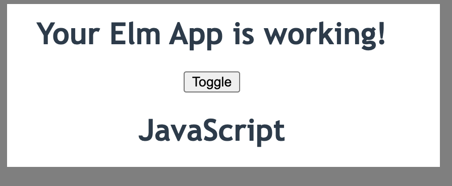

# Elm Toggle App

A small example to illustrate state, actions, messages and visualization in Elm.

Try out the app here
https://finnpedersenkazes.github.io/elm-toggle/

The code in the file `src/Main.elm`

# Create Elm App

This project is bootstrapped with [Create Elm App](https://github.com/halfzebra/create-elm-app).

